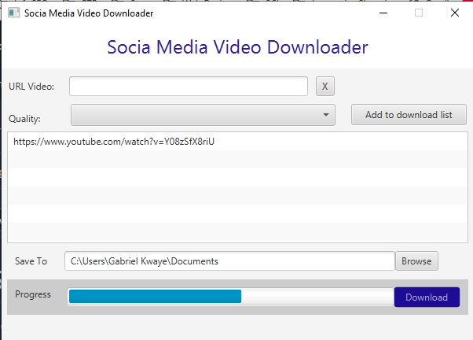

# Social Media Video Downloader
Development of a Java/JavaFX Application for Social Media Video Downloads

## Overview:

The goal is to create a desktop application using Java and JavaFX that allows users to download videos from social media platforms. The application should feature an intuitive and user-friendly interface, include a progress bar to track the download status, and display modal alerts to notify users when downloads are complete.

## Key Features:

**URL Input:** A text field where users can enter the URL of the video to be downloaded.

**URL Validation:** Verify if the entered URL is valid and supported by the application.

**Download Queue:** Add URLs to a list to allow multiple downloads to be queued.

**Progress Tracking:** Display a progress bar to show the real-time status of each download.

**Completion Notification:** Use modal alert dialogs to notify users when downloads finish.

**SceneBuilder** was used to design the UI

## Technical Challenges:

- Integration of third-party libraries or APIs for downloading videos from supported platforms (TBA).
- Real-time updates to the progress bar during downloads.
- Handling concurrent downloads in a thread-safe manner.
- Ensuring the application is responsive while downloads are in progress.
- This project aims to provide a seamless experience for users who want to easily and efficiently download videos from social media platforms.

## How to run

- _cd_ in side the project folder
- Install all packages: _mvn clean package_
- Run the application: _mvn javafx:run_

